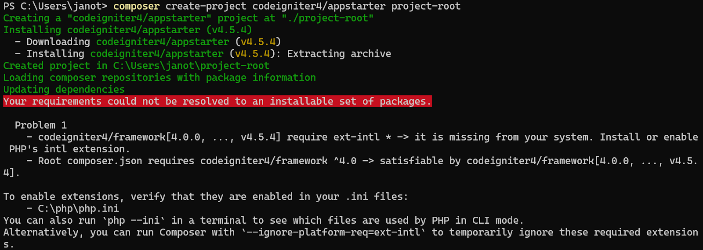

---

# Installation de CodeIgniter

## Prérequis

- PHP version 7.4 ou supérieure
- Composer installé
- Extension `intl` activée dans votre fichier `php.ini` du dossier d'installation de PHP

## Installation de CodeIgniter

### Option 1 : Créer un projet via Composer

Pour installer CodeIgniter, exécutez la commande suivante pour créer un nouveau projet dans le répertoire `project-root` :

```bash
composer create-project codeigniter4/appstarter project-root
```




Si vous modifiez manuellement le fichier `composer.json`, veillez à spécifier la version de CodeIgniter souhaitée :

```json
"require": {
    ...
    "codeigniter4/framework": "4.4.8"
}
```

Ensuite, exécutez la commande suivante pour mettre à jour le projet :

```bash
composer update
```

> **Remarque :** Si vous utilisez un numéro de version fixe comme `"codeigniter4/framework": "4.4.8"`, la commande `composer update` ne mettra pas à jour le framework vers la dernière version.

### Option 2 : Spécifier directement une version de CodeIgniter

Si vous souhaitez installer une version spécifique, vous pouvez exécuter cette commande :

```bash
composer create-project codeigniter4/appstarter:4.4.8 project-root
```


## Configuration de l'application

Après avoir installé CodeIgniter, il y a quelques configurations importantes à réaliser.

### Modifier l'URL de base

Allez dans le fichier `app/Config/App.php` et modifiez la variable `$baseUrl` pour refléter l'URL à laquelle votre application sera accessible. Assurez-vous d'inclure un slash à la fin :

```php
public $baseURL = 'http://localhost:8080/';
```

### Suppression de `index.php` dans l'URL

Dans le même fichier, modifiez la variable `$indexPage` pour supprimer le `index.php` de l'URL :

```php
public $indexPage = '';
```

### Configurer la base de données

Rendez-vous dans le fichier `app/Config/Database.php` pour configurer votre connexion à la base de données.

### Activer le mode développement

Dupliquez le fichier `env` à la racine du projet en `.env`, puis dans le fichier `.env`, retirez le `#` devant la ligne suivante pour activer le mode développement :

```bash
CI_ENVIRONMENT = development
```

## Vérification des configurations PHP

Pour vérifier les recommandations PHP pour la mise en production, exécutez la commande suivante à la racine du projet :

```bash
php spark phpini:check
```

> Si vous ne pouvez pas utiliser la commande `spark`, vous pouvez ajouter la méthode suivante dans votre contrôleur pour effectuer la vérification :

```php
CheckPhpIni::run(false);
```

## Lancer le serveur de développement

Pour lancer le serveur de développement, exécutez la commande suivante :

```bash
php spark serve
```

L'application sera disponible à l'URL configurée dans `$baseUrl`. Si vous avez activé le mode développement, l'environnement actuel sera indiqué en bas de la page.

### Personnaliser l'hôte ou le port

Vous pouvez personnaliser l'hôte ou le port du serveur avec les commandes suivantes :

- Spécifier un hôte :

```bash
php spark serve --host example.dev
```

- Spécifier un port :

```bash
php spark serve --port 8081
```

- Utiliser une version spécifique de PHP :

```bash
php spark serve --php /usr/bin/php7.6.5.4
```

## Déploiement sur un serveur Apache

Pour déployer votre application sur un serveur Apache, assurez-vous de donner les bonnes permissions d'écriture à vos dossiers.

---

Cela devrait rendre vos notes plus structurées et claires pour une utilisation.