---

# Installation de CodeIgniter

## Plan

- Introduction
- Installation de Composer
- Installation de CodeIgniter
- Déploiement de CodeIgniter sur un serveur WAMP 


## Prérequis

- Composer installé
- Extension `intl` activée dans votre fichier `php.ini` du dossier d'installation de PHP


## Introduction

### Introduction à CodeIgniter

CodeIgniter est un framework PHP léger et performant, conçu pour les développeurs souhaitant créer des applications web rapides et robustes. Il est reconnu pour sa simplicité, sa documentation complète, et son architecture MVC (Modèle-Vue-Contrôleur), ce qui permet de structurer efficacement le code.

Ce framework est idéal pour ceux qui recherchent un environnement de développement agile, avec une courbe d'apprentissage rapide, tout en offrant des outils puissants pour des applications de petite à grande échelle.

### Objectif de ce manuel

Ce manuel d'utilisation a pour but de guider les utilisateurs à travers les étapes d'installation, de configuration et de déploiement de CodeIgniter, que ce soit en environnement de développement local ou sur un serveur de production. Vous y trouverez des instructions détaillées, des bonnes pratiques, ainsi que des conseils pour tirer le meilleur parti de CodeIgniter lors de vos projets de développement web.

## Installation de Composer

Composer est un gestionnaire de dépendances pour PHP, essentiel pour installer et gérer les packages nécessaires dans votre projet. Suivez ces étapes pour installer Composer.

### Étape 1 : Téléchargement de Composer

1. Rendez-vous sur le site officiel de Composer : [https://getcomposer.org](https://getcomposer.org)
2. Cliquez sur le bouton **Download**.

### Étape 2 : Installation de Composer (Windows)

1. Téléchargez et exécutez l'installeur Composer pour Windows disponible [ici](https://getcomposer.org/Composer-Setup.exe).
2. Suivez les instructions à l'écran pour terminer l'installation. L'assistant d'installation détectera automatiquement l'emplacement de votre exécutable PHP, mais vous pouvez le spécifier manuellement si nécessaire.

### Étape 3 : Vérification de l'installation

Pour vérifier que Composer est correctement installé, ouvrez une fenêtre de terminal (CMD ou PowerShell sous Windows, Terminal sous macOS ou Linux) et tapez la commande suivante :

```bash
composer
```


###  Étape 4 : Configuration de Composer

Une fois l'installation terminée, Composer est prêt à être utilisé. Vous pouvez configurer des alias ou ajuster vos paramètres de proxy si nécessaire.

---

Ces étapes illustrées devraient vous aider à installer Composer facilement.

## Installation de CodeIgniter

### Option 1 : Créer un projet via Composer

Pour installer CodeIgniter, exécutez la commande suivante pour créer un nouveau projet dans le répertoire `project-root` :

```bash
composer create-project codeigniter4/appstarter project-root
```
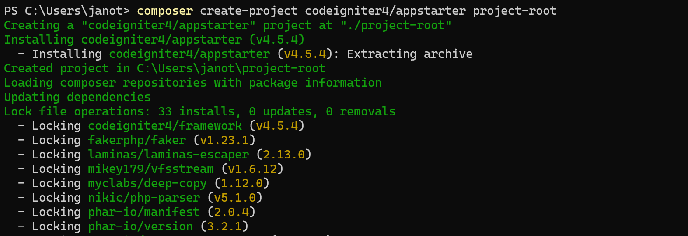

> **Remarque :** Si vous avec l'erreur suivante, c'est que l'extension `intl` n'est pas activée dans le fichier `php.ini`. Il suffira de retirer le `;` du début de ligne.
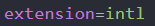
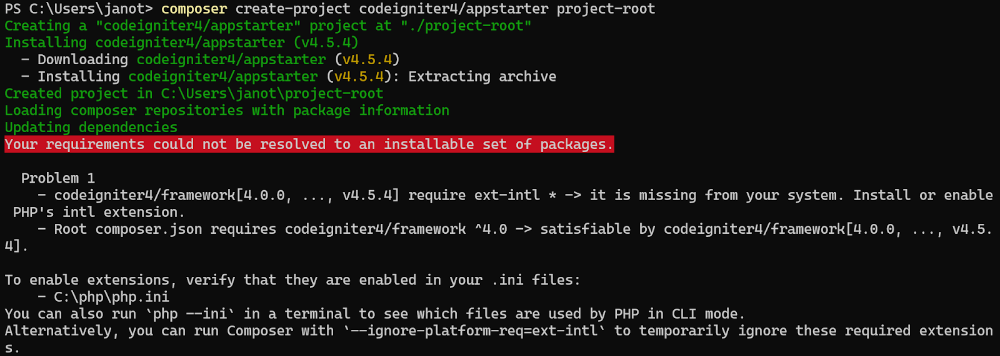


Si vous modifiez manuellement le fichier `composer.json`, veillez à spécifier la version de CodeIgniter souhaitée :

```json
"require": {
    ...
    "codeigniter4/framework": "4.4.8"
}
```

Ensuite, exécutez la commande suivante pour mettre à jour le projet :

```bash
composer update
```

> **Remarque :** Si vous utilisez un numéro de version fixe comme `"codeigniter4/framework": "4.4.8"`, la commande `composer update` ne mettra pas à jour le framework vers la dernière version.

### Option 2 : Spécifier directement une version de CodeIgniter

Si vous souhaitez installer une version spécifique, vous pouvez exécuter cette commande :

```bash
composer create-project codeigniter4/appstarter:4.4.8 project-root
```


A la fin de l'installation, on devrait retrouver les dossiers ci-contre :
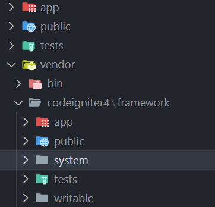

## Configuration de l'application

Après avoir installé CodeIgniter, il y a quelques configurations importantes à réaliser.

### Modifier l'URL de base

Allez dans le fichier `app/Config/App.php` et modifiez la variable `$baseUrl` pour refléter l'URL à laquelle votre application sera accessible. Assurez-vous d'inclure un slash à la fin :

```php
public $baseURL = 'http://localhost:8080/';
```
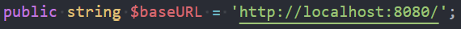

### Suppression de `index.php` dans l'URL

Dans le même fichier, modifiez la variable `$indexPage` pour supprimer le `index.php` de l'URL :

```php
public $indexPage = '';
```
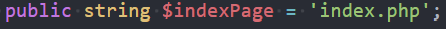

### Configurer la base de données

Rendez-vous dans le fichier `app/Config/Database.php` pour configurer votre connexion à la base de données.
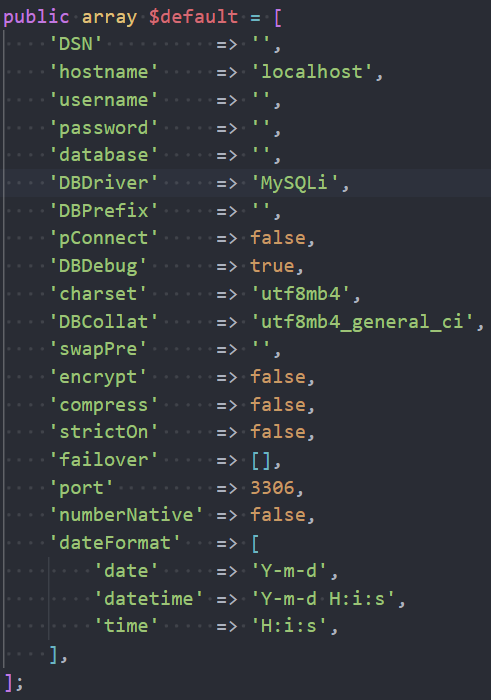

### Activer le mode développement

Dupliquez le fichier `env` à la racine du projet en `.env`, puis dans le fichier `.env`, retirez le `#` devant la ligne suivante pour activer le mode développement :

```bash
CI_ENVIRONMENT = development
```
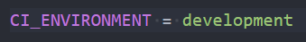
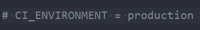

## Vérification des configurations PHP

Pour vérifier les recommandations PHP pour la mise en production, exécutez la commande suivante à la racine du projet :

```bash
php spark phpini:check
```

> Si vous ne pouvez pas utiliser la commande `spark`, vous pouvez ajouter la méthode suivante dans votre contrôleur pour effectuer la vérification :

```php
CheckPhpIni::run(false);
```

## Lancer le serveur de développement

Pour lancer le serveur de développement, exécutez la commande suivante :

```bash
php spark serve
```

L'application sera disponible à l'URL configurée dans `$baseUrl`. Si vous avez activé le mode développement, l'environnement actuel sera indiqué en bas de la page.
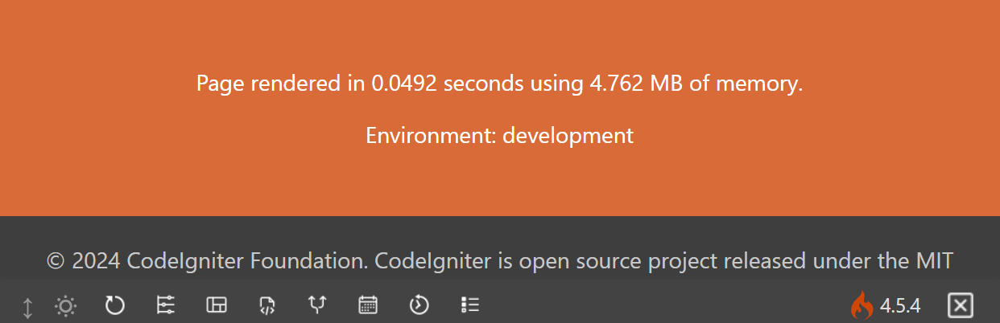

### Personnaliser l'hôte ou le port

Vous pouvez personnaliser l'hôte ou le port du serveur avec les commandes suivantes :

- Spécifier un hôte :

```bash
php spark serve --host localhost
```
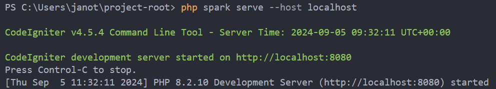

- Spécifier un port :

```bash
php spark serve --port 8081
```
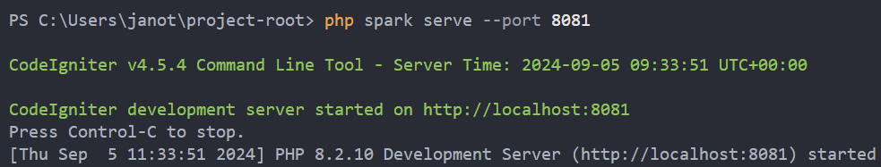

- Utiliser une version spécifique de PHP :

```bash
php spark serve --php /usr/bin/php7.6.5.4
```

## Déploiement de CodeIgniter sur un serveur WAMP

Pour déployer CodeIgniter sur un serveur WAMP, suivez les étapes suivantes :

### Étape 1 : Télécharger CodeIgniter

1. Rendez-vous sur le site officiel de CodeIgniter : [https://codeigniter.com](https://codeigniter.com).
2. Cliquez sur **Download** pour télécharger la dernière version sous forme de fichier `.zip`.

### Étape 2 : Extraire le fichier dans le répertoire WAMP

1. Une fois le fichier téléchargé, extrayez son contenu.
2. Copiez le dossier extrait (généralement nommé `CodeIgniter-4.x.x`) et placez-le dans le répertoire `www` de WAMP. Le chemin par défaut du répertoire `www` est :

   ```bash
   C:\wamp64\www
   ```

3. Renommez le dossier de votre projet comme vous le souhaitez (par exemple, `mon_projet_ci`).

### Étape 3 : Accéder à votre projet

1. Ouvrez WAMP et démarrez les services Apache et MySQL.
2. Accédez à votre projet via l'URL suivante dans votre navigateur :

   ```bash
   http://localhost/mon_projet_ci
   ```
